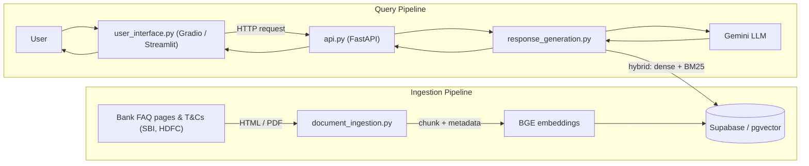

# RAG Financial Advisor 🏦

**A retrieval-augmented generation assistant for Indian retail banking FAQs and product Terms & Conditions.**

[](https://opensource.org/licenses/MIT)


Ask consumer-facing banking questions in plain English — *"What's the recurring deposit interest rate at SBI?"*, *"How long does it take to get a credit card from HDFC?"* — and get an answer grounded in real bank FAQ and T&C documents, with sources attached.

---

## 🎥 Demo

> 📹 **Demo video coming soon** — a 2-3 minute walkthrough showing the retrieval + generation pipeline answering real banking questions will be embedded here.

---

## 🧠 What this is

Most RAG tutorials use generic or academic datasets. This project targets a genuinely useful, domain-specific use case: **consumer banking Q&A grounded in real, publicly available Indian bank documentation** (SBI, HDFC — prototype phase, scaling to ICICI, Axis, Kotak).

It's built with an eye toward production concerns, not just "does it answer questions":
- **Hybrid retrieval** (dense + sparse) to handle bank-specific terminology and exact figures that pure semantic search tends to blur
- **A hosted, production-aligned vector store** (Supabase/pgvector) instead of a local-only vector DB
- **RAGAS evaluation** to actually measure retrieval and generation quality, not just eyeball it
- **A clean API boundary** (FastAPI) so the RAG logic is a deployable service, not just a notebook script

---

## 🏗️ Architecture



Every chunk carries metadata — **bank, product category, document type, source URL** — so retrieval can be filtered and answers can cite where they came from.

---

## 🛠️ Tech stack

| Layer | Technology |
|---|---|
| Orchestration | LangChain |
| Vector store | Supabase / pgvector (Postgres) |
| Embeddings | HuggingFace `BAAI/bge-small-en-v1.5` |
| Retrieval | Hybrid — dense (pgvector) + sparse (BM25) via `EnsembleRetriever` |
| LLM | Google Gemini |
| Evaluation | RAGAS |
| Tracing | LangSmith |
| API | FastAPI |
| UI | Gradio / Streamlit |

---

## 📊 Evaluation (RAGAS)

v1 baseline, measured on a hand-authored set of ~20-30 Q&A pairs against the ingested SBI + HDFC documents:

| Metric | Score |
|---|---|
| Faithfulness | 0.8167 |
| Context Precision | 0.6000 |
| Context Recall | 0.6250 |

**Reading these honestly:** faithfulness is solid — the model is largely staying grounded in retrieved content rather than hallucinating. Context precision and recall are more moderate, which points at retrieval — not generation — as the next place to invest: better chunking, tuning the hybrid retriever's dense/sparse weighting, and expanding the document set are the likely levers for the next iteration.

*(Same-model self-grading caveat: Gemini is used as both the generator and the RAGAS judge here — a known bias risk worth keeping in mind when interpreting these numbers.)*

---

## 📁 Project structure

```
RAG_Financial_Advisor/
├── config.py                # env vars, model names, chunk size (pydantic-settings)
├── models.py                 # Pydantic schemas — API I/O + chunk metadata
├── document_ingestion.py     # fetch → parse → chunk → embed → upsert to Supabase
├── response_generation.py    # embed query → hybrid retrieve → prompt → LLM → response
├── api.py                    # FastAPI routes
├── user_interface.py         # Gradio / Streamlit UI (calls api.py over HTTP)
├── requirements.txt
├── .env.example
└── README.md
```

---

## 🚀 Getting started

**1. Clone and set up the environment**
```bash
git clone https://github.com/om-dhanve/RAG_Financial_Advisor.git
cd RAG_Financial_Advisor
python -m venv .venv
.venv\Scripts\activate      # Windows
pip install -r requirements.txt
```

**2. Configure environment variables**

Copy `.env.example` to `.env` and fill in:
```
GOOGLE_API_KEY=your_gemini_api_key
SUPABASE_URL=your_supabase_project_url
SUPABASE_KEY=your_supabase_service_key
LANGCHAIN_API_KEY=your_langsmith_key   # optional, for tracing
```

**3. Ingest documents into the vector store**
```bash
python document_ingestion.py
```

**4. Run the API**
```bash
uvicorn api:app --reload
```
Swagger docs available at `http://localhost:8000/docs`.

**5. Run the UI**
```bash
streamlit run user_interface.py
# or, if using Gradio:
python user_interface.py
```

---

## 🖼️ Screenshots

> 📸 *Screenshots coming soon — will show the UI, a sample query/response, and retrieved sources with metadata.*

---

## ⚠️ Known issues

- **ragas 0.4.3 import bug** — `ModuleNotFoundError` for `langchain_community.chat_models.vertexai` at import time ([ragas#2745](https://github.com/explodinggradients/ragas/issues/2745), [#2753](https://github.com/explodinggradients/ragas/issues/2753)). Worked around with a direct patch to `ragas/llms/base.py`; the patch doesn't survive a venv rebuild.
- **ragas column naming** — current ragas expects `user_input` / `response` / `retrieved_contexts` / `reference`, not the older `question` / `answer` / `contexts` / `ground_truth` naming still floating around in some tutorials. Using the old names doesn't error — it silently produces no score.
- **Prototype scope** — currently ingested for SBI + HDFC, Recurring/Fixed Deposits + Credit Cards only. Scaling to ICICI, Axis, Kotak and additional product lines is in progress.
- **No retrieval failure fallback yet** — a query with no relevant matches doesn't yet degrade gracefully.

---

## 🗺️ Roadmap

- [ ] Scale ingestion to ICICI, Axis, Kotak
- [ ] Add source citations directly in the UI response
- [ ] Graceful retrieval failure handling
- [ ] Structured logging (replace remaining `print()` calls)
- [ ] Hosted live demo
- [ ] Expand to personal loans, home loans, insurance FAQs

---

## 📬 Contact

**Om Dhanve**
📧 omdhanve.bsns@gmail.com
🔗 [LinkedIn](https://www.linkedin.com/in/om-dhanve-6400b72a6)
💻 [GitHub](https://github.com/om-dhanve)

---

## 📄 License

This project is licensed under the [MIT License](LICENSE).
